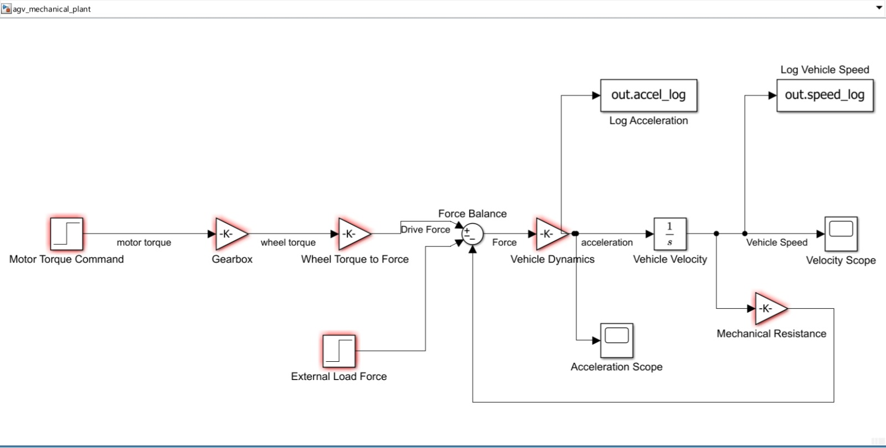
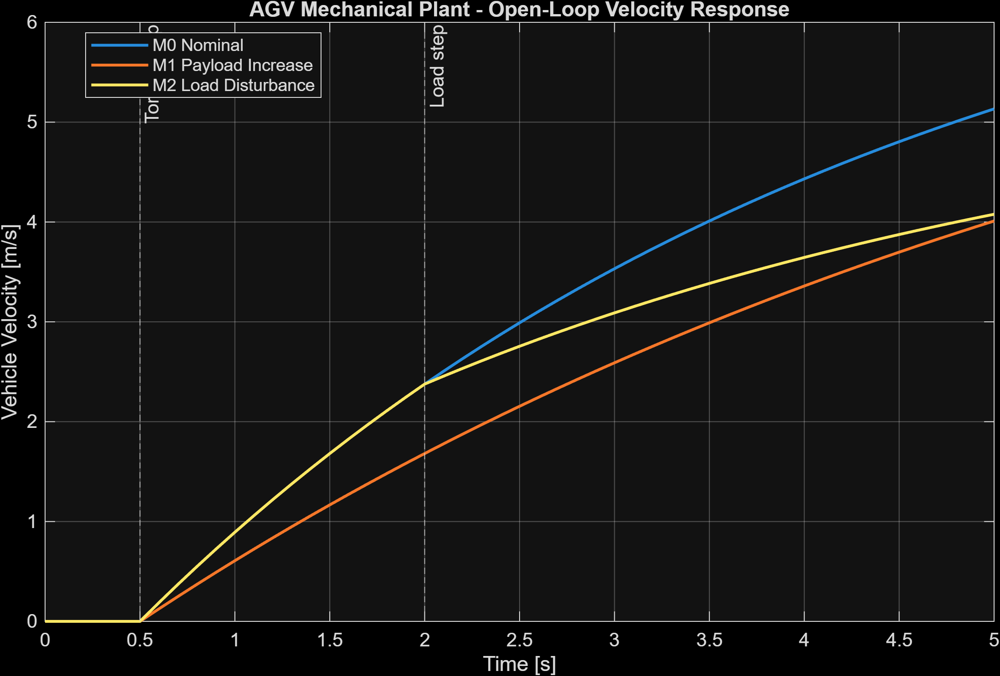
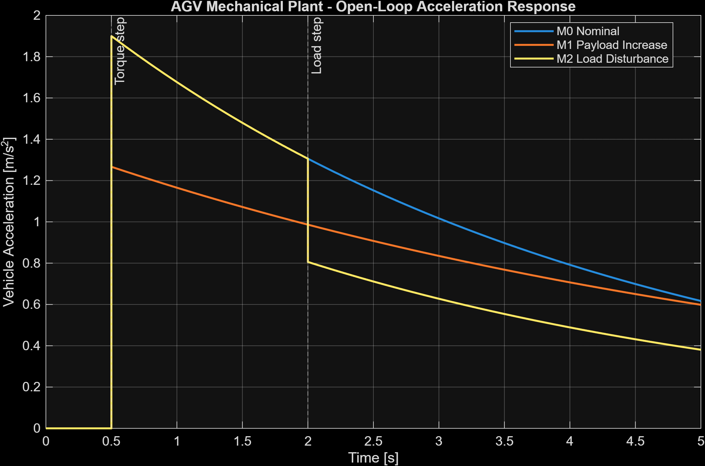

[README.md](https://github.com/user-attachments/files/32520460/README.md)
# Model-Based Electric Drive Control & Virtual Verification Platform

[](https://www.mathworks.com/products/matlab.html)
[](https://www.mathworks.com/products/simulink.html)


**Verified MATLAB/Simulink AGV longitudinal plant with automated analytical cross-validation and reproducible engineering evidence.**

## Simulink model



## Results at a glance

| Nominal | Payload | External load | Viscous resistance |
|:---:|:---:|:---:|:---:|
| **PASS** | **PASS** | **PASS** | **PASS** |
| 200 kg | 300 kg | 50 N opposing load | 50 N·s/m |

| Velocity response | Acceleration response |
|:---:|:---:|
|  |  |

### Verified numerical checks

| Test | Analytical reference | Simulation | Error | Result |
|---|---:|---:|---:|:---:|
| Nominal acceleration | 1.9000 m/s² | 1.9000 m/s² | 0.000000 m/s² | **PASS** |
| Payload acceleration | 1.2667 m/s² | 1.2667 m/s² | 0.000000 m/s² | **PASS** |
| Load-disturbance acceleration | 1.6500 m/s² | 1.6500 m/s² | 0.000000 m/s² | **PASS** |
| Velocity at 2.5 s | 2.9904 m/s | 2.9904 m/s | 0.000000 m/s | **PASS** |
| Acceleration at 2.5 s | 1.1524 m/s² | 1.1524 m/s² | 0.000000 m/s² | **PASS** |

Errors are shown at the reporting precision used by the automated test scripts.

## What this proves

- Built a parameterized AGV mechanical plant in **Simulink**.
- Derived analytical references from the governing drivetrain equations.
- Automated baseline, payload, external-load and resistance verification in **MATLAB**.
- Cross-validated simulation outputs at defined verification points.
- Generated traceable plots, CSV datasets, MAT results and a text verification report.
- Structured the project for repeatable testing and future control-development phases.

## Reproduce the results

### Requirements

- MATLAB R2026a Update 4
- Simulink

### Run

```bash
git clone https://github.com/yashrk7174/AGV-Electric-Drive-Control-VNV.git
cd AGV-Electric-Drive-Control-VNV
```

From MATLAB, open the project and initialize the configuration:

```matlab
openProject("Electric-driveproject.prj");
run("config/init_project.m");
```

Run the verified tests:

```matlab
run("tests/mechanical/test_mechanical_baseline.m");
run("tests/mechanical/test_mechanical_scenarios.m");
```

Regenerate the evidence package:

```matlab
run("matlab/analysis/generate_mechanical_phase2_evidence.m");
```

## Evidence package

The complete verified output is stored in [`results/mechanical`](results/mechanical):

- nominal, payload and load-disturbance CSV datasets;
- scenario-summary CSV;
- raw MAT results;
- velocity and acceleration response plots;
- Simulink model screenshot;
- automated verification report.

## Repository structure

```text
.
├── config/                 Centralized model and test parameters
├── matlab/analysis/        Automated evidence generation
├── models/                 Simulink plant model
├── resources/project/      MATLAB Project metadata
├── results/mechanical/     Verified plots, datasets and report
├── tests/mechanical/       Baseline and scenario verification
└── Electric-driveproject.prj
```

## Engineering configuration

| Parameter | Value |
|---|---:|
| AGV mass | 200 kg |
| Wheel radius | 0.10 m |
| Gear ratio | 10:1 |
| Drivetrain efficiency | 95% |
| Motor torque | 4.0 N·m |
| Drive force | 380 N |
| Resistance coefficient | 50 N·s/m |
| Torque step | 0.5 s |
| Load step | 2.0 s |
| Stop time | 5.0 s |

<details>
<summary><strong>Model equations</strong></summary>

Longitudinal dynamics:

```text
m·dv/dt = F_drive − F_load − b·v
```

Drivetrain force:

```text
F_drive = T_motor · gear_ratio · efficiency / wheel_radius
```

The current resistance coefficient is an engineering assumption used for verification; it was not identified from a specific physical AGV.

</details>

## Development status

### Verified

- [x] Centralized parameter configuration
- [x] Parameterized longitudinal plant
- [x] Analytical baseline cross-validation
- [x] Nominal, payload and external-load scenarios
- [x] Viscous-resistance verification
- [x] Automated evidence export

### Next milestones

- [ ] Closed-loop velocity PI control
- [ ] PMSM field-oriented control
- [ ] Power-electronics model
- [ ] State and disturbance estimation
- [ ] Model-in-the-loop regression suite
- [ ] Software-in-the-loop verification

## Author

**Yash Khiste**  
M.Sc. Electrical Engineering and Information Technology  
Otto von Guericke University Magdeburg  
[LinkedIn](https://www.linkedin.com/in/yash-khiste-95b8371a9)
